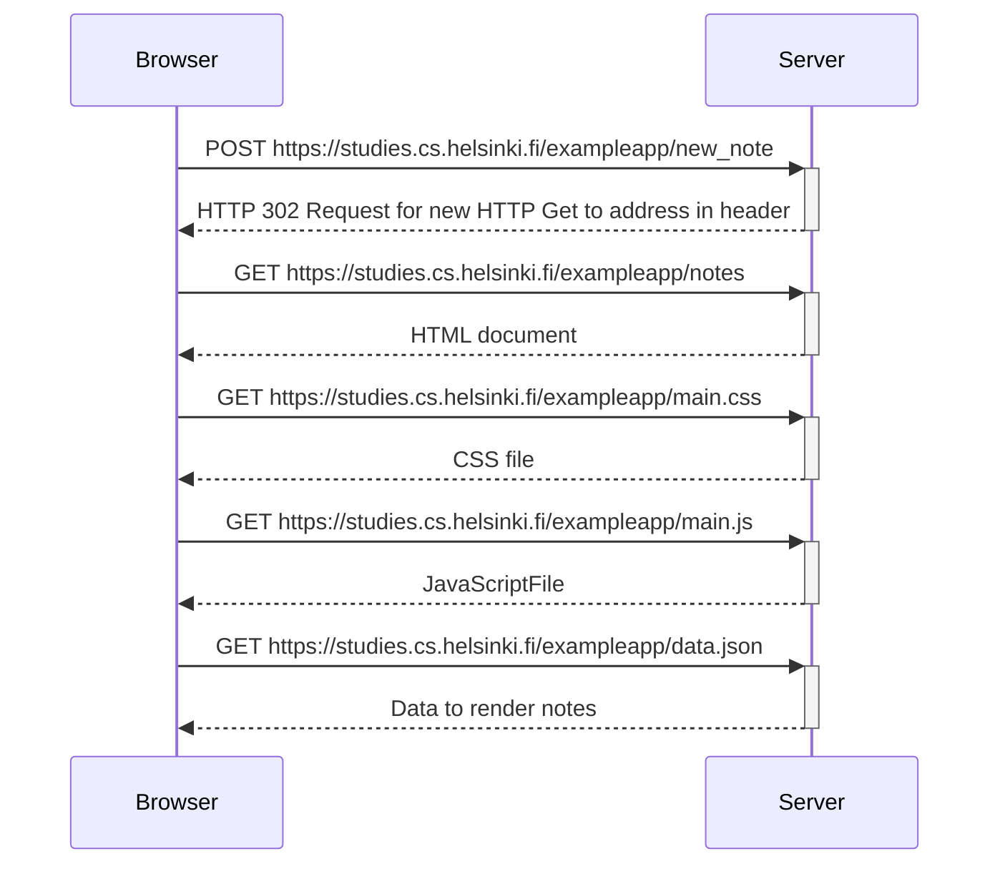

```mermaid
sequenceDiagram
    Browser->>+Server: POST https://studies.cs.helsinki.fi/exampleapp/new_note
    Server-->>-Browser: HTTP 302 Request for new HTTP Get to address in header
    Browser->>+Server: GET https://studies.cs.helsinki.fi/exampleapp/notes
    Server-->>-Browser: HTML document
    Browser->>+Server: GET https://studies.cs.helsinki.fi/exampleapp/main.css
    Server-->>-Browser: CSS file
    Browser->>+Server: GET https://studies.cs.helsinki.fi/exampleapp/main.js
    Server-->>-Browser: JavaScriptFile
    Browser->>+Server: GET https://studies.cs.helsinki.fi/exampleapp/data.json
    Server-->>-Browser: Data to render notes
```
